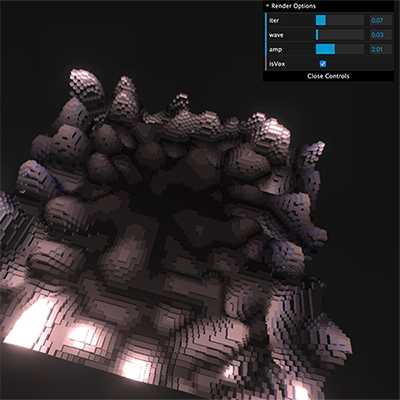

###


# React Three Fiber / Instance Demo




Paul J Karlik

  

Just starting to get the basics down of ```react-three-fiber```. This demo creates a r3f component that makes a 30x30 grid, then calculates its placement  (as there are 9 on the screen) so the math works where ever it's placed. It's a total of 8100 blocks moving around.. just pretty and fun!

- Babel7
- React Three Fiber
- ThreeJS

## Run the example

Requires Node v12.13.1 or greater

```bash
$ yarn
$ yarn start
```

open http://localhost:2020
